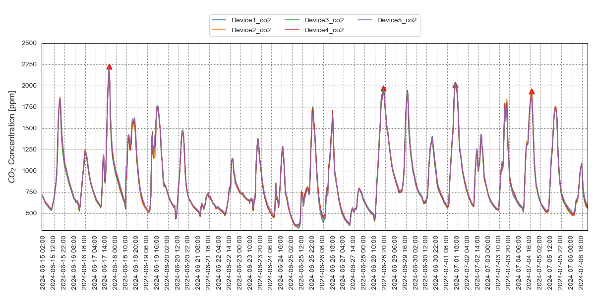

# RESET Air Project
RESET Air is a project by GIGA.Reset aimed at monitoring air quality parameters over approximately one month to evaluate the air's quality and consistency. This repository contains the full pipeline for the project, including data processing, analysis, visualization, and report generation to evaluate the monitored data.

## Project Overview
### 1. Data Processing
The raw data is transformed into standardized formats where all monitored parameters are stored in a single file. The data is then prepared for analysis and visualization by aggregating parameter statistics over time. Our solution includes automating peak detection using the find_peaks package, allowing for automatic peak identification and extraction from the dataset.

In the past, employees had to manually search for peaks in visualizations and trace them back to the dataset. Now, our automated approach significantly reduces manual effort.

### 2. Data Analysis and Visualization
We visualize parameter trends over the monitoring period, highlighting the peaks and extracting relevant statistics at those peak times. The data visualizations provide insights into air quality patterns, and the automated peak-finding algorithm eliminates the need for manual data extraction.

### 3. Report Generation
The final report compares data from all monitors at peak times with their average and with data from a GIGA monitor. The report calculates the percentage difference between these values. Automating this process has saved the company significant time, as it previously required manual calculations in Excel and multiple imports.

## Usage
### Data Input:

Place the dataset (including time and air quality parameters) into the folder 1_Data/0_received.
### Peak Detection:

Open 0_Script/peak_finding.ipynb, update the column names and range for the graph, and run the script.
The script will output CSV files containing peak data for each parameter and corresponding visualizations.\
Example output:
| datetime | reference_co2 | Device1_co2 | Device2_co2 | Device3_co2 |
|----------|----------|----------|----------|----------|
|   2024-06-25 07:30:00|   400.0 |   366.8|   348.6	 |   357.6 |
|   2024-07-01 08:00:00|   622.0 |   585.0 |   330.9 |   515.4 |

### Report Generation:

To generate the evaluation report, run analysis_report.ipynb. This will create CSV files for each parameter, and generate a report that compares the data at peak times with the average values.\
Example output:
||Device1_humidity|	Device2_humidity|	Device3_humidity|	Device4_humidity|	Device5_humidity
|----------|----------|----------|----------|----------|----------|
|percent_diff|	-0.05%|	0.07%|	0.19%|	1.31%|	-1.54%|
|pass_fail|	Pass|	Pass|	Pass|	Pass|	Pass|
|reference|	1.51%|	1.63%|	1.75%|	2.87%|	0.02%|
|reference_pass_fail|	Pass|	Pass|	Pass|	Pass|	Pass|

#### For more details about RESET Air, check https://www.reset.build/standard/air

